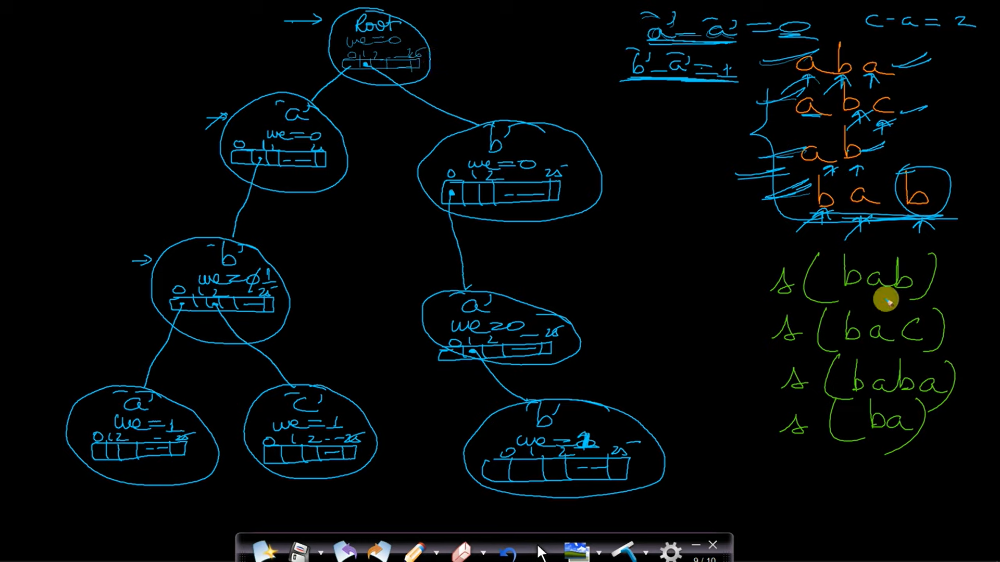
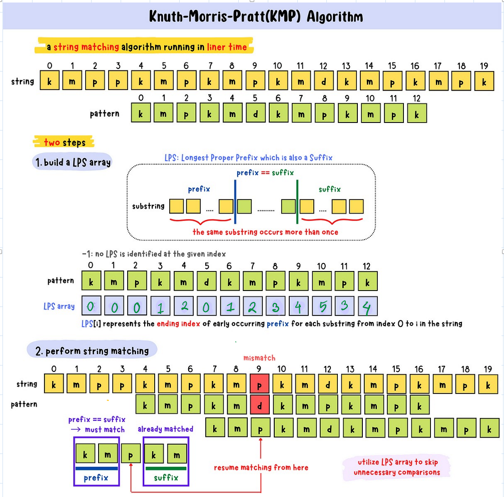

1. Linked Lists:
   - Singly
   - Doubly
   - Circular linked lists
   - Operations (Insertion, Deletion, Reversal)

2. Stacks and Queues:
   - Implementations and use cases
   - Operations (Push, Pop, Enqueue, Dequeue)

3. Trees:
   - Binary Trees
   - Binary Search Trees (BST)
   - Tree traversal (In-order, Pre-order, Post-order)
   - AVL trees and balancing

4. Heaps:
   - Min and max heaps
   - Heap operations (Insert, Delete, Extract-Min/Max)

5. Hash Tables:
   - Collision resolution (Chaining, Open addressing)
   - Hash functions

6. Graphs:
   - Representation (Adjacency matrix, Adjacency list)
   - Depth-First Search (DFS) and Breadth-First Search (BFS)
   - Shortest path algorithms (Dijkstra, Bellman-Ford)
   - Minimum Spanning Tree (Prim's, Kruskal's)

7. Trie:
   - Basic operations
   - Use cases (Autocomplete)

8. Searching:
   - Binary search
   - Linear search
  
9. Sorting:
   - Insertion sort
   - Counting sort
   - Radix sort
   - Merge sort
   - Quick sort
   - Heap sort
   - Intro sort(Quick+Heap+Insertion)
   
10. Dynamic Programming:
    - Fibonacci sequence
    - Longest Common Subsequence (LCS)
    - Knapsack problem

11. Backtracking:
    - N-Queens problem
    - Subset sum
    - Sudoku solver

12. Bit Manipulation:
    - Bitwise operations
    - Counting set bits
    - Finding the single non-repeating element

13. String Algorithms:
    - KMP
    - Rabin-Karp
    - String manipulation (Reverse, Rotation, Compression)
    - Pattern matching (RegEx, Wildcard)


<https://leetcode.com/studyplan/top-interview-150/>

# Array & String

## 1. Marge Sort

<https://leetcode.com/problems/merge-sorted-array/?envType=study-plan-v2&envId=top-interview-150> \
Given 2 sorted array a=[1,3,5,0,0,0],n=3,b=[2,4,6],m=3\
Sort the array with non-decreasing order.

```cpp
void merge(vector<int>& a, int n, vector<int>& b, int m) {
        
        int i=n-1;
        int j=m-1;
        int k=n+m-1;
        

        while(i>=0 and j>=0)
        {
            if(a[i]>b[j])
            {
                a[k--]=a[i--];
            }
            else
            {
                a[k--]=b[j--];
            }
        }
        while(j>=0)
        {
            a[k--]=b[j--];
        }
} 
```

Lets solve marge sort

```cpp
#include <bits/stdc++.h>
using namespace std;
int temp[100000];

void merging(int arr[], int l, int mid, int r)
{
    int low, up, k;
    low = l;
    up = mid + 1;

    for (k = low; low <= mid && up <= r; k++)
    {
        if (arr[low] < arr[up])
            temp[k] = arr[low++];
        else
            temp[k] = arr[up++];
    }
    while (low <= mid)
        temp[k++] = arr[up++];

    while (up <= r)
        temp[k++] = arr[up++];

    for (k = l; k <= r; k++)
        arr[k] = temp[k];
}
void MergeSort(int a[], int low, int up)
{
    if (up <= low)
        return;
    int mid = (low+up)/ 2;
    MergeSort(a, low, mid);
    MergeSort(a, mid + 1, up);
    merging(a, low, mid, up);
}
int main()
{
    int n;
    cin >> n;
    int array[n + 2];
    for (int i = 0; i < n; i++)
    {
        cin >> array[i];
    }
    MergeSort(array, 0, n - 1);
}
```

## 2. Megority Element

The majority element is the element that appears more than ⌊n / 2⌋ times. Given a array find the mejority element of the array.

### Boyer-Moore Majority Voting Algorithm

O(N) time complexity and O(1) space complexity.

```cpp
int majorityElement(vector<int> &nums)
{
    int mejority = 1e9 + 10, count = 1;
    for (int i = 0; i < nums.size(); i++)
    {
        if (nums[i] == mejority)
            count++;
        else
            count--;
        if (count == 0)
        {
            mejority = nums[i];
            count = 1;
        }
    }
    return mejority;
}
```

Here count always more then 1 after complete full iteration becouse 1 element exist which occurrence more then n/2. That's why it's work.

## Insert Delete GetRandom O(1)

<https://leetcode.com/problems/insert-delete-getrandom-o1/description/?envType=study-plan-v2&envId=top-interview-150>

- RandomizedSet() Initializes the RandomizedSet object.
- bool insert(int val) Inserts an item val into the set if not present. Returns true if the item was not present, false otherwise.
- bool remove(int val) Removes an item val from the set if present. Returns true if the item was present, false otherwise.
- int getRandom() Returns a random element from the current set of elements (it's guaranteed that at least one element exists when this method is called). Each element must have the same probability of being returned.

```cpp
class RandomizedSet {
    unordered_map<int,int>mp;
    vector<int>v;
public:
    RandomizedSet() {
        
    }
    
    bool insert(int val) {

        if(mp.find(val)!=mp.end())
        {
            return false;
        }
        v.push_back(val);
        mp[val]=v.size()-1;
        return true;
    }
    
    bool remove(int val) {
        if(mp.find(val)==mp.end())
        {
            return false;
        }
        mp.erase(v.back());
        mp[v.back()]=mp[val];
        v[mp[val]]=v.back();
        v.pop_back();
        mp.erase(val);
        
        return true;
    }
    
    int getRandom() {
        return v[rand()%v.size()];
    }
};
```

- The technique use here is push in array and index of element store in map. when we need to remove then replace last element of the array with the val (which i want to remove) element.

# Data Structure

## Custom stack

```cpp
#include<iostream>
using namespace std;
#define SIZE 100
class stack {
    int stck[SIZE];
    int tos;
public:
    stack()
    {
        tos = 0;
    }
    void push(int i);
    int pop();
};
void stack::push(int i)
{
    if (i == SIZE)
    {
        cout << "Stack is full.\n";
        return;
    }
    stck[tos] = i;
    tos++;
}
int stack::pop()
{
    if (tos == 0)
    {
        cout << "Stack underflow.\n";
        return 0;
    }
    tos--;
    return stck[tos];
}
int main() {

    stack st1;
    st1.push(1);
    st1.push(2);
    cout << st1.pop() << endl;
}
```

## Trie Data structure



- wordEndCnt = number of word end in this node.
- Every TrieNode could be 26 childNode which a-z.

Youtube best resource -TechDose <https://youtube.com/playlist?list=PLEJXowNB4kPyi859E6qGUs7jlpQehJndl&si=fHbZ8HJVwq5GJGhm>

Best Article with code -Scaler <https://www.scaler.com/topics/data-structures/trie-data-structure/>

```cpp
#include <iostream>
#include <vector>
using namespace std;

class TrieNode
{
  public:
    int wordEndCnt;
    TrieNode *childNode[26];

    TrieNode()
    {
        wordEndCnt = 0;
        for (int i = 0; i < 26; i++)
        {
            childNode[i] = NULL;
        }
    }
};

void insertKey(TrieNode *root, string s)
{
    TrieNode *currentNode = root;

    for (auto i : s)
    {
        if (currentNode->childNode[i - 'a'] == NULL)
        {
            TrieNode *newNode = new TrieNode();
            currentNode->childNode[i - 'a'] = newNode;
        }
        currentNode = currentNode->childNode[i - 'a'];
    }
    currentNode->wordEndCnt++;
    return;
}

bool searchKey(TrieNode *root, string s)
{
    TrieNode *currentNode = root;

    for (auto i : s)
    {
        if (currentNode->childNode[i - 'a'] == NULL)
        {
            return false;
        }
        currentNode = currentNode->childNode[i - 'a'];
    }

    return currentNode != NULL and currentNode->wordEndCnt > 0;
}

bool deleteKey(TrieNode *root, string s)
{
    TrieNode *currentNode = root;

    for (auto i : s)
    {
        if (currentNode->childNode[i - 'a'] == NULL)
        {
            return false;
        }
        currentNode = currentNode->childNode[i - 'a'];
    }

    if (currentNode != NULL and currentNode->wordEndCnt > 0)
    {
        currentNode->wordEndCnt--;
        return true;
    }

    return false;
}

int main()
{
    TrieNode *root = new TrieNode();

    vector<string> inputStrings = {"tea", "ten", "eat", "ear", "bat", "ball"};
    int n = inputStrings.size();

    for (int i = 0; i < n; i++)
    {
        insertKey(root, inputStrings[i]);
    }

    vector<string> searchQueryStrings = {"tea", "to", "bal"};
    int searchQueries = searchQueryStrings.size();
    for (int i = 0; i < searchQueries; i++)
    {
        cout << "Query String : " << searchQueryStrings[i] << "\n";
        if (searchKey(root, searchQueryStrings[i]))
        {
            cout << "present in the Trie\n";
        }
        else
        {
            cout << "not present in the Trie\n";
        }
    }

    vector<string> deleteQueryStrings = {"tea", "tea"};
    int deleteQueries = deleteQueryStrings.size();

    for (int i = 0; i < deleteQueries; i++)
    {
        cout << "Query String : " << deleteQueryStrings[i] << "\n";
        if (deleteKey(root, deleteQueryStrings[i]))
        {
            cout << "successfully deleted\n";
        }
        else
        {
            cout << "not present in the Trie\n";
        }
    }
    return 0;
}
```

# Linked List

Basic Link list program

```cpp

#include <bits/stdc++.h>
using namespace std;

class Node
{
  public:
    int value;
    Node *next;
};

int main()
{

    Node *head;
    Node *one = new Node();
    Node *two = new Node();
    Node *three = new Node();

    one->value = 1;
    two->value = 2;
    three->value = 3;

    head = one;
    one->next = two;
    two->next = three;
    three->next = NULL;

    while (head)
    {
        cout << head->value << " ";
        head = head->next;
    }
    return 0;
}
```

Add value to the end

```cpp
#include <bits/stdc++.h>
using namespace std;

class Node
{
  public:
    int value;
    Node *next;

    Node(int val)
    {
        value = val;
        next = NULL;
    }
};

void AddFirst(Node *&head, int val)
{

    Node *newNode = new Node(val);
    if (!head)
    {
        head = newNode;
        return;
    }
    Node *newHead = head;

    while (newHead->next)
    {
        newHead = newHead->next;
    }
    newHead->next = newNode;

    return;
}

int main()
{

    Node *head;
    while (1)
    {

        int val;
        cout << "Enter value ";
        cin >> val;
        AddFirst(head, val);
        if (val == -1)
            break;
    }
    while (head)
    {
        cout << head->value << " ";
        head = head->next;
    }
    return 0;
}

```

Added to the first.

```cpp
#include <bits/stdc++.h>
using namespace std;

class Node
{
  public:
    int value;
    Node *next;

    Node(int val)
    {
        value = val;
        next = NULL;
    }
};

void AddFirst(Node *&head, int val)
{
    Node *newNode = new Node(val);
    if (!head)
    {
        head = newNode;
        return;
    }
    newNode->next = head;
    head = newNode;
}

int main()
{

    Node *head;
    while (1)
    {

        int val;
        cout << "Enter value ";
        cin >> val;
        if (val == -1)
            break;

        AddFirst(head, val);
    }
    while (head)
    {
        cout << head->value << " ";
        head = head->next;
    }
    return 0;
}
```

# String Algorithm

## KMP



Many coder build lps with -1 valus. But I feel comfort with zero zero valus. I think learn this algorithm all about 2,3 time matching the LPS array your own.

```cpp
#include <bits/stdc++.h>
using namespace std;

int kmp(string &str, string ptrn, vector<int> &lps)
{
    int i = 0, j = 0;

    while (j < str.size())
    {
        if (ptrn[i] == str[j])
        {
            i++, j++;
            if (i == ptrn.size())
            {
                return 1;
            }
        }
        else
        {
            if (i != 0)
            {
                i = lps[i - 1];
            }
            else
            {
                j++;
            }
        }
    }
    return 0;
}

vector<int> LPS(string &s)
{
    vector<int> lps(s.size(), 0);

    int i = 0, j = 1;

    while (j < s.size())
    {
        if (s[i] == s[j])
        {
            i++;
            lps[j] = i;
            j++;
        }
        else
        {
            if (i != 0)
            {
                i = lps[i - 1];
            }
            else
            {
                lps[j] = 0;
                j++;
            }
        }
    }
    // for (int i = 0; i < lps.size(); i++)
    // {
    //  cout << lps[i] << " ";
    // }
    // cout << endl;
    return lps;
}

int main()
{
    string str = "kmppkmpkmpkmdkmpkmpk";
    string pattern = "kmpkmdkmpkmpk";

    vector<int> lpsArray = LPS(pattern);
    int ans = kmp(str, pattern, lpsArray);

    if (ans)
    {
        cout << "YES";
    }
    else
    {
        cout << "NO";
    }
    return 0;
}
```

## Robin-Karp algorithm 
