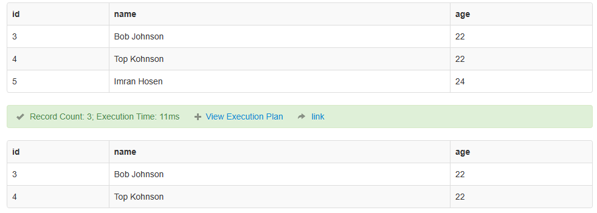

# Introduction to SQL

- SQL stands for Structured Query Language
- SQL lets you access and manipulate databases

## RDBMS

- RDBMS stands for Relational Database Management System.
- The data in RDBMS is stored in database objects called tables. A table is a collection of related data entries and it consists of columns and rows.
- A relational database defines database relationships in the form of tables. The tables are related to each other - based on data common to each.

## SQL commands

- SELECT - extracts data from a database
- UPDATE - updates data in a database
- DELETE - deletes data from a database
- INSERT INTO - inserts new data into a database
- CREATE DATABASE - creates a new database
- ALTER DATABASE - modifies a database
- CREATE TABLE - creates a new table
- ALTER TABLE - modifies a table
- DROP TABLE - deletes a table
- CREATE INDEX - creates an index (search key)
- DROP INDEX - deletes an index

### SELECT

Create example table

~~~~sql
-- Create a table
CREATE TABLE example (
    id INT PRIMARY KEY,
    name VARCHAR(50),
    age INT
);

-- Insert data into the table
INSERT INTO example (id, name, age)
VALUES
    (1, 'John Doe', 25),
    (2, 'Jane Smith', 30),
    (3, 'Bob Johnson', 22),
    (4, 'Top Kohnson', 22);

~~~~

Table look like this.


1. ```select * from example;```\
Full table will show.
2. ```select name,id from example;```\
Only name and id will show. **Note** that here first name then id. It's maintain the order of query.

3. ```select distinct * from example;```\
Does not take duplicate rows. Each copy only one piece.
4. ```select distinct age from example;```\
First Select selected colume(age) then remove duplicate rows.

5. ```select count(distinct age) from example;```\
Return the number of distinct row with coloum=age

6. ```select count(distinct age,name) from example;```\
Return the number of distinct row with coloum=age,name


## WHERE

Table same as older one.


1. ```select * from example where age>=25;```\
   
2. ```select name,id from example where age>=25 and id=2;```
   
3. BETWEEN\
   ```select name,age from example where age between 20 and 25;```
   
4. LIKE\
   ```select name,age from example where name like "j%";```
   
5. IN\
   ```select name from example where name in ("John Doe","Bob Johnson");```
   

- We can also use **distinct** and **count** here if we need.
- Alse we can use And,or not(!) operation same as c++.

## ORDER BY ( ASC | DESC )

```sql
SELECT column1, column2, ...
FROM table_name
ORDER BY column1, column2, ... ASC|DESC;
```

Table


```select * from example order by name;```
```select * from example order by name asc;```

```select name, id from example order by name ASC;```

```select * from example order by age ASC,id DESC;```


## INSERT INTO

1. Adding value to the all columns

```sql
INSERT INTO table_name (column1, column2, column3, ...)
VALUES (value1, value2, value3, ...);
```

2. Adding value to the specify columns

```sql
INSERT INTO table_name VALUES (value1, value2, value3, ...);
```

Table same as older one.


```insert into example (id,name,age) values (5,"Imran",26);```
```insert into example values (5,"Imran",26);```

```insert into example (id,name) values (5,"Imran");```


## NULL VALUE

A NULL value is different from a zero value or a field that contains spaces. A field with a NULL value is one that has been left blank during record creation!

```sql
SELECT column_names
FROM table_name
WHERE column_name IS NULL;
```

```sql
SELECT CustomerName, ContactName, Address
FROM Customers
WHERE Address IS NULL;
```

```sql
select * from example where age is null;
```


## UPDATE Syntax

```sql
UPDATE table_name
SET column1 = value1, column2 = value2, ...
WHERE condition;
```


```update example set name='test',age=30 where id=3;```

```update example set age=30 ;```


## DELETE Syntax

Table


```sql
delete from example where id=4;
```


- Delete All Records

```sql
delete from example ;
```

Here all record will be deleted.

## LIMIT Syntax

```sql
SELECT column_name(s)
FROM table_name
WHERE condition
LIMIT number;
```

Table


- Select first 3 rows.

```sql
select * from example limit 3;
```


- From index(offset) i to limit x

```sql
select * from example LIMIT 3 OFFSET 1;
-- Here start from index 1+ and take 3 element.
```


## Min() Max()

Table


```sql
select max(age) from example ;
```


```sql
select min(age) from example;
```


## COUNT(), AVG() and SUM()

- count

```sql()
SELECT COUNT(column_name)
FROM table_name
WHERE condition;
```

- avg()

```sql
SELECT AVG(column_name)
FROM table_name
WHERE condition;
```

- sum()

```sql
SELECT SUM(column_name)
FROM table_name
WHERE condition;
```

Table


Operation

```sql
select count(age) from example;
select avg(age) from example;
select sum(age) from example;
```


## Wildcard Characters

- (%) represent zero or more characters (bl%-> black,blue)
- (_) represent a single character h_t-> hot, hat, hit

## Like syntax

```sql
SELECT column1, column2, ...
FROM table_name
WHERE columnN LIKE pattern;
```

Table


```sql
select * from example where name like '%n';
select * from example where name like '%so_%';
```



## IN Syntax

```sql
SELECT column_name(s)
FROM table_name
WHERE column_name IN (value1, value2, ...);
```

```sql
SELECT column_name(s)
FROM table_name
WHERE column_name IN (SELECT STATEMENT);
```

Table


```sql
select * from example where age in (22,30);
select * from example where name in (select name from student);
```


1st table is example and second one is student.

## Between syntax

```sql
SELECT column_name(s)
FROM table_name
WHERE column_name BETWEEN value1 AND value2;
```
