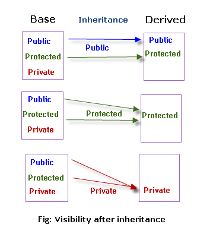
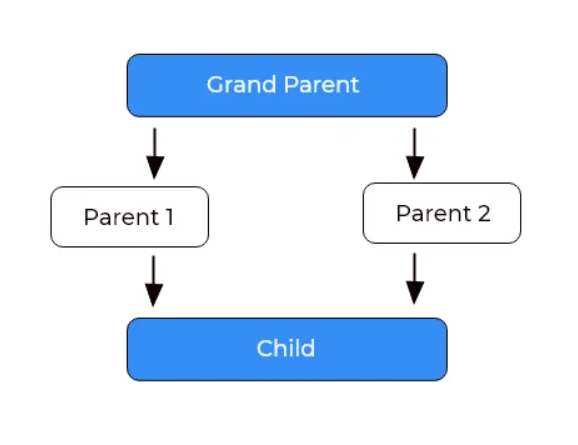

<!-- TOC start (generated with https://github.com/derlin/bitdowntoc) -->

- [**1 Core Concept**](#1-core-concept)
  - [**1.1 Classes and Objects:**](#11-classes-and-objects)
  - [**1.2 Encapsulation:**](#12-encapsulation)
  - [**1.3 Inheritance:**](#13-inheritance)
  - [**1.4 Polymorphism:**](#14-polymorphism)
  - [**1.5 Abstraction:**](#15-abstraction)
- [**2. Classes and Objects**](#2-classes-and-objects)
  - [**2.1 Structures vs. Classes:**](#21-structures-vs-classes)
  - [**2.2 Unions and Classes:**](#22-unions-and-classes)
  - [**2.3 Friend Functions and Friend Classes:**](#23-friend-functions-and-friend-classes)
  - [**2.4 Inline Functions:**](#24-inline-functions)
  - [**2.5 Parameterized Constructors:**](#25-parameterized-constructors)
  - [**2.6 Static Class Members:**](#26-static-class-members)
  - [**2.7 Constructors and Destructors:**](#27-constructors-and-destructors)
  - [**2.8 Scope Resolution Operator (::):**](#28-scope-resolution-operator-)
  - [**2.9 Nested and Local Classes:**](#29-nested-and-local-classes)
  - [**2.10 Access Specifiers (public, private, protected):**](#210-access-specifiers-public-private-protected)
  - [**2.11 Data Members and Member Functions:**](#211-data-members-and-member-functions)
  - [**2.12 Object Lifetime:**](#212-object-lifetime)
  - [**2.13 Constant Member Functions:**](#213-constant-member-functions)
- [**3. Arrays of Objects and Pointers**](#3-arrays-of-objects-and-pointers)
  - [**3.1 Arrays of Objects:**](#31-arrays-of-objects)
  - [**3.2 Pointers to Objects:**](#32-pointers-to-objects)
  - [**3.3 The `this` Pointer:**](#33-the-this-pointer)
  - [**3.4 Pointers to Derived Types:**](#34-pointers-to-derived-types)
  - [**3.5 References:**](#35-references)
  - [**3.6 Dynamic Allocation (new and delete):**](#36-dynamic-allocation-new-and-delete)
- [**4. Polymorphism**](#4-polymorphism)
  - [**4.1 Compile-time Polymorphism:**](#41-compile-time-polymorphism)
    - [**4.1.1 Function Overloading:**](#411-function-overloading)
    - [**4.1.2 Operator Overloading:**](#412-operator-overloading)
  - [**4.2 Runtime Polymorphism:**](#42-runtime-polymorphism)
    - [**4.2.1 Function Overriding:**](#421-function-overriding)
  - [**4.3 Virtual Functions and Dynamic Polymorphism:**](#43-virtual-functions-and-dynamic-polymorphism)
    - [**4.3.1 Dynamic Polymorphism**](#431-dynamic-polymorphism)
    - [**4.3.2 Pure Virtual Function Example:**](#432-pure-virtual-function-example)
    - [**4.3.3. Abstract Class:**](#433-abstract-class)
- [**5. Inheritance**](#5-inheritance)
  - [**5.1 Base-Class Access Control:**](#51-base-class-access-control)
  - [**5.2 Multiple Inheritance:**](#52-multiple-inheritance)
  - [**5.3 Constructors, Destructors, and Inheritance:**](#53-constructors-destructors-and-inheritance)
  - [**5.4 Virtual Base Classes:**](#54-virtual-base-classes)
  - [**5.5 Inheritance Hierarchies:**](#55-inheritance-hierarchies)
  - [**5.6 Type Casting:**](#56-type-casting)
- [**6. Additional Topics:**](#6-additional-topics)
  - [**6.1 Object Composition:**](#61-object-composition)
  - [**6.2 Design Patterns:**](#62-design-patterns)
  - [**6.3 Exception Handling:**](#63-exception-handling)
  - [**6.4 File I/O:**](#64-file-io)
  - [**6.5 Lambda Expressions:**](#65-lambda-expressions)

<!-- TOC end -->


# **1 Core Concept**

## **1.1 Classes and Objects:**

* **Classes:** Imagine a blueprint for creating objects. It defines the properties (data) and behaviors (functions) that objects of that type will have.
* **Objects:** Instances of a class, like individual houses built from the same blueprint. Each object has its own unique values for its properties.

**Example:**

```c++
class Dog {
public:
    std::string name;
    int age;
    void bark() {
        std::cout << "Woof!" << std::endl;
    }
};

// Create two Dog objects
Dog fido = {"Fido", 3};
Dog buddy = {"Buddy", 5};
```

## **1.2 Encapsulation:**

* Hiding the internal details of an object, exposing only essential information through a public interface.
* Protects data integrity and makes code more modular and maintainable.

**Example:**

```c++
class BankAccount {
private:
    double balance;

public:
    void deposit(double amount) {
        balance += amount;
    }

    double getBalance() {
        return balance;
    }
};
```

## **1.3 Inheritance:**

* Creating new classes (derived classes) that inherit properties and behaviors from existing classes (base classes).
* Promotes code reusability and establishes hierarchical relationships between classes.

**Example:**

```c++
class Animal {
public:
    virtual void makeSound() = 0; // Pure virtual function
};

class Dog : public Animal {
public:
    void makeSound() override {
        std::cout << "Woof!" << std::endl;
    }
};

class Cat : public Animal {
public:
    void makeSound() override {
        std::cout << "Meow!" << std::endl;
    }
};
```

## **1.4 Polymorphism:**

* The ability of objects of different classes to respond differently to the same method call.
* Enables flexible and adaptable code.

**Example:**

```c++
Animal* animal = new Dog();
animal->makeSound();  // Output: Woof!

animal = new Cat();
animal->makeSound();  // Output: Meow!
```

## **1.5 Abstraction:**

* Focusing on essential features of an object while hiding implementation details.
* Simplifies complex systems and makes code more manageable.

**Example:**

```c++
class Car {
public:
    virtual void start() = 0;
    virtual void accelerate() = 0;
    virtual void brake() = 0;
};
```


# **2. Classes and Objects**

## **2.1 Structures vs. Classes:**

* **Structures:** Bundle data of different types together, but members are public by default.
* **Classes:** Combine data and functions, offering more control with access specifiers.

**Example:**

```c++
struct Student { // Members are public by default
    int id;
    std::string name;
};

class Course { // Members can be private, protected, or public
private:
    int courseID;
public:
    std::string courseName;
};
```

## **2.2 Unions and Classes:**

* **Unions:** Share the same memory location for different data members, but only one member can hold a value at a time.
* **Classes:** Each member has its own distinct memory allocation.

**Example:**

```c++
union Value {
    int num;
    char ch;
};
int main() {
    Value v;
    v.num = 10; // Stores 10 in the shared memory
    v.ch = 'A';

    cout << v.num << endl;// print garbage
    cout << v.ch << endl; // print A

    return 0;
}// Overwrites the 10 with 'A' // Overwrites the 10 with 'A'
```

## **2.3 Friend Functions and Friend Classes:**

* **Friend Functions:** Non-member functions granted access to private and protected members of a class.
* **Friend Classes:** All member functions of one class can access private and protected members of another class.

**Example Friend Function:**

```cpp
#include<bits/stdc++.h>
using namespace std;

class myclass
{
    int a, b;
public:
    friend int sum(myclass x);//Friend declared
    void set_ab(int i, int j);
};

void myclass::set_ab(int i, int j) {
    a = i;
    b = j;
}

int sum(myclass x) {

    return x.a + x.b;
}
int main() {
    myclass n;
    n.set_ab(2, 3);
    cout << sum(n);
    return 0;
}
```
**Example Friend Class:**
```cpp
#include<bits/stdc++.h>
using namespace std;
class TwoValues {
	int a;
	int b;
public:

	TwoValues(int i, int j) {
		a = i, b = j;
	}
	friend class Min;
};

class Min {
public:
	int min(TwoValues x) {
		return x.a < x.b ? x.a : x.b;
	}
};

int main() {

	TwoValues ob(10, 20);
	Min m;
	cout << m.min(ob);
	return 0;
}
// //output
// 10
```

## **2.4 Inline Functions:**

* Defined within a class, usually for short functions to potentially improve performance by avoiding function call overhead.

* Very small function.
* The functions are called several times in a program.
* When a function is defined inside a class declaration, it is automatically made into an inline function (if possible).

**Example:**

```c++
class Rectangle {
public:
    int length, width;
    inline int getArea() { // Inline function
        return length * width;
    }
    void show();
};
inline void myclass::show()
{
    cout << length*width << "\n";
}
```

## **2.5 Parameterized Constructors:**

* Constructors are special functions that initialize an object when it is created.
* Parameterized constructors allow passing values to initialize member variables during object creation.

```c++
class Point {
public:
    int x, y;
    Point(int x_, int y_) : x(x_), y(y_) {} // constructor with parameters
};

Point p1(10, 20); // creates a Point object with x=10 and y=20
```

## **2.6 Static Class Members:**

* Only one copy of that variable will exist and that all objects of the classwill share that variable.No matter how many objects of a class are created, only one copy of a static data member exists. All static variables are initialized to zero and created before the first object is created.

```c++
# include<bits/stdc++.h>
using namespace std;
class employee
{
    int id;
    static int count;
public:
    void setData(int i)
    {
        id = i;
        count++;
    }
    void getData(void)
    {
        cout << "ID: " << id << ", Number of employee: " << count << endl;
    }

};
int employee::count;//global added. without globaly it's not initialize.
int main() {

    employee a, b, c;
    a.setData(3);//count=1
    b.setData(4);//count=2
    c.setData(1);//count=3

    b.getData();
    return 0;
}

```

## **2.7 Constructors and Destructors:**

* **Constructors:** Initialize objects when they are created.
* **Destructors:** Free resources and perform cleanup when objects are destroyed.

```c++
class Account {
public:
    Account(int balance) : balance(balance) {} // constructor initializes balance
    ~Account() { std::cout << "Account destroyed." << std::endl; } // destructor prints message
private:
    int balance;
};
```

## **2.8 Scope Resolution Operator (::):**

* Accesses class members from outside the class, including static members and member functions.
* Used to disambiguate between member names and global names.

```c++
class MyClass {
public:
    static int value; // static member variable
};

int MyClass::value = 10; // definition outside the class using scope resolution operator

int main() {
    std::cout << MyClass::value << std::endl; // outputs 10
}
```

## **2.9 Nested and Local Classes:**

* **Nested Classes:** Defined within another class, providing encapsulation and logical grouping.
* **Local Classes:** Defined within a function scope, accessible only within that function.

```c++
class Game {
public:
    class Player { // nested class representing a player
        int health;
        void attack();
    };
    void startGame() {
        class Enemy { // local class representing an enemy within the function
            int damage;
        };
        Enemy enemy;
        // ... game logic with Player and Enemy ...
    }
};
```

## **2.10 Access Specifiers (public, private, protected):**

* Control access to class members:
    * **public:** accessible from anywhere
    * **private:** accessible only within the class
    * **protected:** accessible within the class, its derived classes, and friend functions

```c++
class Person {
private:
    int age; // only accessible within the class
public:
    void setAge(int age_) { age = age_; } // setter function to modify private member
    int getAge() const { return age; } // getter function to access private member
};
```

## **2.11 Data Members and Member Functions:**

* **Data Members:** Variables that store the state of an object.
* **Member Functions:** Functions that define the behavior of an object.

```c++
class Calculator {
public:
    int add(int a, int b) { return a + b; } // member function to add two numbers
    int data; // data member to store a value
};
```

## **2.12 Object Lifetime:**

* Objects are created with `new` and destroyed with `delete` for dynamically allocated memory.
* Automatic objects (declared within a function) are created when the function enters scope and destroyed when it exits.

```c++
int main() {
    Calculator* calc = new Calculator(); // dynamically allocated object
    int result = calc->add(10, 20);
    delete calc; // manually deallocate memory
    // ...
}
```

## **2.13 Constant Member Functions:**

* Cannot modify the state of the object (no assignments to member variables).
* Useful for accessing data without accidentally modifying it.

```c++
class Student {
public:
    const int id; // constant member variable
    int getAge() const { return age; } // constant member function
private:
    int age;
};
```

# **3. Arrays of Objects and Pointers**

## **3.1 Arrays of Objects:**

* Create multiple objects of the same class in a contiguous memory block.
* Access elements using array indexing like regular arrays.

```c++
class Student {
public:
    std::string name;
    int age;
};

Student students[5]; // Array of 5 Student objects
students[0].name = "Alice"; // Access and assign values
students[1].age = 25;
```

## **3.2 Pointers to Objects:**

* Store memory addresses of objects, allowing indirect access and manipulation.
* Use the arrow operator (`->`) to access members of objects pointed to.

```c++
Student* studentPtr = new Student(); // Create a Student object dynamically
studentPtr->name = "Bob"; // Access members using arrow operator
delete studentPtr; // Deallocate memory when done
```

## **3.3 The `this` Pointer:**

* A hidden pointer in every object's member functions, pointing to the object itself.
* Used to access the current object's members within a member function.

```c++
class Book {
public:
    std::string title;
    void setTitle(std::string title_) {
        this->title = title_; // Use 'this' to differentiate member from parameter
    }
};
```

## **3.4 Pointers to Derived Types:**

* A pointer to a base class can also point to objects of derived classes.
* However, only members of the base class can be directly accessed through such a pointer.

```c++
class Shape {
public:
    virtual void draw() = 0; // Pure virtual function
};

class Circle : public Shape {
public:
    void draw() override {
        std::cout << "Drawing a circle." << std::endl;
    }
};

Shape* shapePtr = new Circle(); // Pointer to base class, pointing to a Circle object
shapePtr->draw(); // Calls Circle's draw() implementation
```

## **3.5 References:**

* Aliases for existing objects, providing an alternative way to access them.
* Declared using the `&` symbol and must be initialized to an existing object.

```c++
int x = 10;
int& ref = x; // ref is a reference to x
ref = 20; // Modifies x through the reference
std::cout << x << std::endl; // Outputs 20
```

## **3.6 Dynamic Allocation (new and delete):**

* `new` operator: Allocates memory for objects dynamically at runtime.
* `delete` operator: Deallocates memory when objects are no longer needed.

```c++
int* numPtr = new int(5); // Dynamically allocates an integer and initializes it to 5
delete numPtr; // Deallocates memory
```

```c++
Balance*p;
p = new Balance [3]; // allocate entire array

p[0].set(12387.87, "Ralph Wilson");
p[1].set(144.00, "A. C. Conners");
p[2].set(-11.23, "I. M. Overdrawn");
for (i = 0; i < 3; i++) {
    p[i].get_bal(n, s);
    cout << s << "'s balance is: " << n << endl;
}
delete [] p;   
```

# **4. Polymorphism**


**Concept:**

* Polymorphism means "many forms." In C++, it allows a single function or operator name to handle objects of different types, depending on their actual type at runtime. This makes code more versatile and reusable.

**Types:**

C++ offers two main types of polymorphism:

## **4.1 Compile-time Polymorphism:**

* This happens when the compiler chooses the correct function or operator based on the types of its arguments at compile time. It involves:
### **4.1.1 Function Overloading:**
Defining multiple functions with the same name but different parameters or return types. The compiler chooses the appropriate function based on the parameter types used when calling it.

```c++
// Add function overloaded for different data types
int add(int a, int b) { return a + b; }
float add(float a, float b) { return a + b; }

int result1 = add(1, 2);  // Compiler chooses integer addition
float result2 = add(1.5f, 2.3f); // Compiler chooses float addition
```

### **4.1.2 Operator Overloading:** 
Defining custom behavior for operators like `+`, `-`, `*`, etc., for specific types. The compiler selects the appropriate overloaded operator based on the operand types.

```c++
class Point {
public:
    int x, y;
        Point operator+(const Point& other) {
            return Point{x + other.x, y + other.y};
    }
};

Point p1, p2;
p1 = p1 + p2; // Custom addition for Point objects
```

## **4.2 Runtime Polymorphism:**

* This happens when the actual type of an object determines which function to call at runtime. It involves:
###  **4.2.1 Function Overriding:** 
Defining a function with the same name and signature in a derived class that modifies the behavior of the inherited function from the base class. When calling the function through a base class pointer or reference, the derived class's implementation is executed based on the object's actual type at runtime.

```c++
class Base {
public:
    void print() {
        cout << "Base Function" << endl;
    }
};

class Derived : public Base {
public:
    void print() {
        cout << "Derived Function" << endl;
    }
};

Derived derived1;
derived1.print(); //  "Derived Function"  will print
```
**C++ Call Overridden Function From Derived Class**
```c++
class Base {
public:
    void print() {
        cout << "Base Function" << endl;
    }
};

class Derived : public Base {
public:
    void print() {
        cout << "Derived Function" << endl;

        // call overridden function
        Base::print();
    }
};

Derived derived1;	// Derived Function
derived1.print();	// Base Function will print	
```

## **4.3 Virtual Functions and Dynamic Polymorphism:**

**Virtual function vs pure virtual function**

```c++
//    Virtual function
class Base {
public:
    virtual void print() {
        // code 
    }
};
```
```c++
// Pure virtual function
class Base {
public:
    virtual void Print() = 0; //  (forces implementation in derived classes)
};
```

- A virtual function can be overridded by derived class to implement polympohysim, non-virtual function can not.
- A virtual function's address is put into a virtual function table, through which a virtual function is called. Non-virtual function is called directly using its address.
- A virtual function participates in dynamic binding and polymorphism. A normal function is resolved at compile time through static binding.


Imagine you're running a zoo, and you want to define how different animals make sounds. Here's how virtual functions and dynamic polymorphism can help:

**1. Base Class: Animal**

- Create a base class called `Animal` with a **virtual function** named `makeSound()`. This function has no implementation in the base class because each animal sounds different.

    ```c++
    class Animal {
    public:
    virtual void makeSound() = 0; // Pure virtual function (forces implementation in derived classes)
    };
    ```

**2. Derived Classes: Dog, Cat, Bird**

- Create derived classes, like `Dog`, `Cat`, and `Bird`, inheriting from `Animal`. Each class implements the `makeSound()` function with its own unique sound:

    ```c++
    class Dog : public Animal {
    public:
    void makeSound() override { std::cout << "Woof!" << std::endl; }
    };

    class Cat : public Animal {
    public:
    void makeSound() override { std::cout << "Meow!" << std::endl; }
    };

    class Bird : public Animal {
    public:
    void makeSound() override { std::cout << "Chirp!" << std::endl; }
    };
    ```

### **4.3.1 Dynamic Polymorphism**


* Imagine you have a function called `playWithAnimal()` that takes an `Animal` pointer as input. This function can use the `makeSound()` function to interact with any animal in the zoo:

```c++
void playWithAnimal(Animal* animal) {
animal->makeSound(); // Calls the appropriate "makeSound()" based on the animal type
// Add other generic interactions that apply to all animals (e.g., feed, pet)
}

playWithAnimal(new Dog()); // Outputs "Woof!"
playWithAnimal(new Cat()); // Outputs "Meow!"
playWithAnimal(new Bird()); // Outputs "Chirp!"
```

Here, dynamic polymorphism allows you to interact with various animals using the same generic function, but their unique sounds shine through due to the overridden functions in each derived class.

### **4.3.2 Pure Virtual Function Example:**

* Create a new function called `eatFood()` in the `Animal` class, but declare it as a pure virtual function:

```c++
class Animal {
public:
virtual void makeSound() = 0; // Existing pure virtual function
virtual void eatFood() = 0; // New pure virtual function

// Other common Animal features (e.g., move, sleep)
};
```

This forces each derived class like `Dog`, `Cat`, and `Bird` to define their own `eatFood()` implementation based on their specific diet:

```c++
class Dog : public Animal {
public:
void eatFood() override { std::cout << "Gnawing on bones!" << std::endl; }
};

class Cat : public Animal {
public:
void eatFood() override { std::cout << "Lapping up milk!" << std::endl; }
};

class Bird : public Animal {
public:
void eatFood() override { std::cout << "Pecking at seeds!" << std::endl; }
};
```

Again, the base class defines the interface (what `eatFood()` means) with a pure virtual function, while each derived class provides its own unique implementation.

### **4.3.3. Abstract Class:**

An abstract class is a class in C++ which have at least one pure virtual function. We cannot create objects of an abstract class.

```c++
class Animal {
public:
virtual void makeSound() = 0; // Existing pure virtual function
virtual void eatFood() = 0; // New pure virtual function

// Other common Animal features (e.g., move, sleep)
};
```
Here Animal is abstruct class

# **5. Inheritance**

## **5.1 Base-Class Access Control:**

- **Controls how derived classes access base class members.**
- **Access specifiers:**
    - **public:** Inherited members stay public.
    - **protected:** Inherited members become protected (accessible within derived classes and friends).
    - **private:** Inherited members become inaccessible in derived classes.
  

    

**Example:**

```c++
class Base {
public:
    int x;
protected:
    int y;
private:
    int z;
};

class Derived : public Base { // Inherits publicly
public:
    void accessMembers() {
        x = 10;  // Can access public member x
        y = 20;  // Can access protected member y
        // z = 30;  // Error: Cannot access private member z
    }
};
```

## **5.2 Multiple Inheritance:**

- **A class inherits from multiple base classes.**
- **Syntax:** `class Derived : public Base1, public Base2 { ... }`
- **Can lead to ambiguity if base classes have members with the same name.**

**Example:**

```c++
class Animal {
public:
    void eat() { ... }
};

class Bird {
public:
    void fly() { ... }
};

class Bat : public Animal, public Bird { // Inherits from both Animal and Bird
public:
    void navigate() {
        eat();  // Inherited from Animal
        fly();  // Inherited from Bird
    }
};
```

## **5.3 Constructors, Destructors, and Inheritance:**

- **Derived class constructors automatically call base class constructors (unless explicitly specified).**
- **Destructors are called in reverse order of constructors (base class destructor first).**

**Example:**

```c++
class Base {
public:
    Base() { cout << "Base constructor" << endl; }
    ~Base() { cout << "Base destructor" << endl; }
};

class Derived : public Base {
public:
    Derived() { cout << "Derived constructor" << endl; }
    ~Derived() { cout << "Derived destructor" << endl; }
};

int main() {
    Derived d;
    // Output: Base constructor, Derived constructor, Derived destructor, Base destructor
}
```

## **5.4 Virtual Base Classes:**

- **Solve the "diamond problem" in multiple inheritance, where a derived class inherits the same base class multiple times.**
- **Uses the `virtual` keyword before the base class name in inheritance lists.**


- So child can access this member through parent1 or parent. So compiler ambiguous shown here. where compiler confused about that which through this member should be access.
  
**Example:**

```c++
class Animal { ... };
class Mammal : virtual public Animal { ... };
class Bird : virtual public Animal { ... };
class Bat : public Mammal, public Bird { ... }; // Bat inherits Animal only once
```

## **5.5 Inheritance Hierarchies:**

- **Classes organized in a tree-like structure, representing relationships.**
- **Derived classes can themselves be base classes for further inheritance.**

## **5.6 Type Casting:**

- **Mechanisms to convert between different types.**
- **C++ provides four casting operators:**
    - **static_cast:** For simple conversions, like int to double.
    - **dynamic_cast:** For safe downcasting in inheritance hierarchies.
    - **reinterpret_cast:** For low-level reinterpretation of bits.
    - **const_cast:** For casting away const-ness.

```c++
#include <iostream> 
using namespace std; 
  
int main() 
{ 
    double x = 1.2; 
  
    // Explicit conversion from double to int 
    int sum = (int)x + 1; 
  
    cout << "Sum = " << sum; 
  
    return 0; 
}
```
```c++

// static_cast
int x = 10;
double y = static_cast<double>(x); // Convert int to double

// dynamic_cast
Animal* animal = new Dog();
Dog* dog = dynamic_cast<Dog*>(animal); // Safe downcasting

// reinterpret_cast
int* ptr = reinterpret_cast<int*>(&y); // Reinterpret bits

// const_cast
const int num = 5;
int* nonConstPtr = const_cast<int*>(&num); // Cast away const-ness
```

# **6. Additional Topics:**

## **6.1 Object Composition:**

- Instead of inheritance, objects use other objects to achieve functionality.
- Promotes code reuse and flexibility.

**Example:**

```c++
class Engine {
public:
  void start() { cout << "Engine started!" << endl; }
};

class Wheel {
public:
  void rotate() { cout << "Wheel rotating!" << endl; }
};

class Car {
private:
  Engine engine;
  Wheel wheels[4]; // Composition: Car has-a Engine and Wheels

public:
  void drive() {
    engine.start();
    for (Wheel& wheel : wheels) {
      wheel.rotate();
    }
    cout << "Car driving!" << endl;
  }
};

int main() {
  Car car;
  car.drive(); // Engine starts, wheels rotate, and car drives
}
```

## **6.2 Design Patterns:**

- Reusable solutions to common software design problems.
- Improve code structure, maintainability, and flexibility.

**Example:**

- **Singleton:** Ensure only one instance of a class exists.

```c++
class Database {
private:
  static Database* instance;
  Database() {} // Private constructor prevents direct object creation

public:
  static Database* getInstance() {
    if (!instance) {
      instance = new Database();
    }
    return instance;
  }

  void connect() { cout << "Connecting to database..." << endl; }
};

Database* Database::instance = nullptr; // Initialize instance to null

int main() {
  Database* db1 = Database::getInstance();
  Database* db2 = Database::getInstance(); // Both point to same instance

  if (db1 == db2) {
    cout << "Only one database instance exists!" << endl;
  }
}
```

## **6.3 Exception Handling:**

- Handle unexpected errors during program execution.
- Avoids program crashes and improves robustness.

**Example:**

```c++
try {
  // Open a file
  ifstream file("data.txt");

  // Read data from file
  int value;
  file >> value;

  // Check if read successful
  if (!file) {
    throw runtime_error("Error reading file!");
  }

  // Process data

} catch (const exception& e) {
  cout << "Error: " << e.what() << endl;
}
```

## **6.4 File I/O:**

- Read and write data to/from files.
- Persistent storage for program data.

**Example:**

```c++
// Write data to file
ofstream writeTheFile("data.txt");
if (writeTheFile.is_open())
{
    writeTheFile << "This is some data to write" << endl;
    writeTheFile.close();

}

// Read data from file
ifstream readTheFile("data.txt");
string line;
if (readTheFile.is_open()) {
    while (getline(readTheFile, line)) {
        cout << line << endl;
    }
    readTheFile.close();
}

```

## **6.5 Lambda Expressions:**

- Anonymous functions defined and used inline.
- Simplify code for small, one-time functions.

**Example:**

```c++
int sum(int a, int b) { return a + b; }

// Lambda expression for the same sum function
auto sumLambda = [](int a, int b) { return a + b; };

int result = sum(5, 10); // 15
result = sumLambda(7, 8); // 15
```

Remember, these are just basic examples. Each topic deserves deeper exploration to become proficient. Keep learning and practicing!
